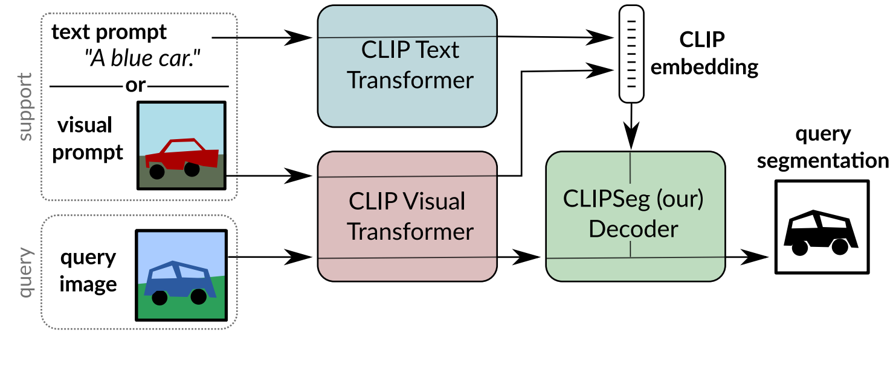
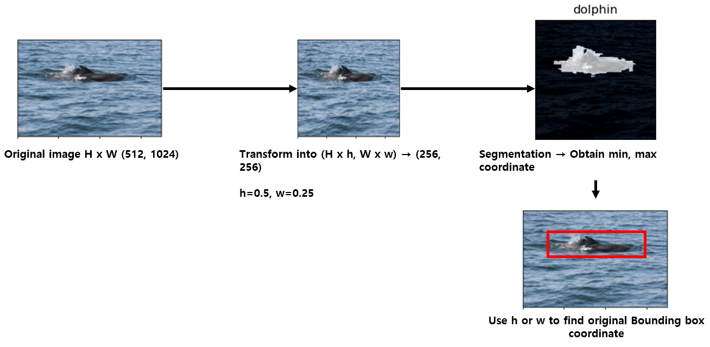
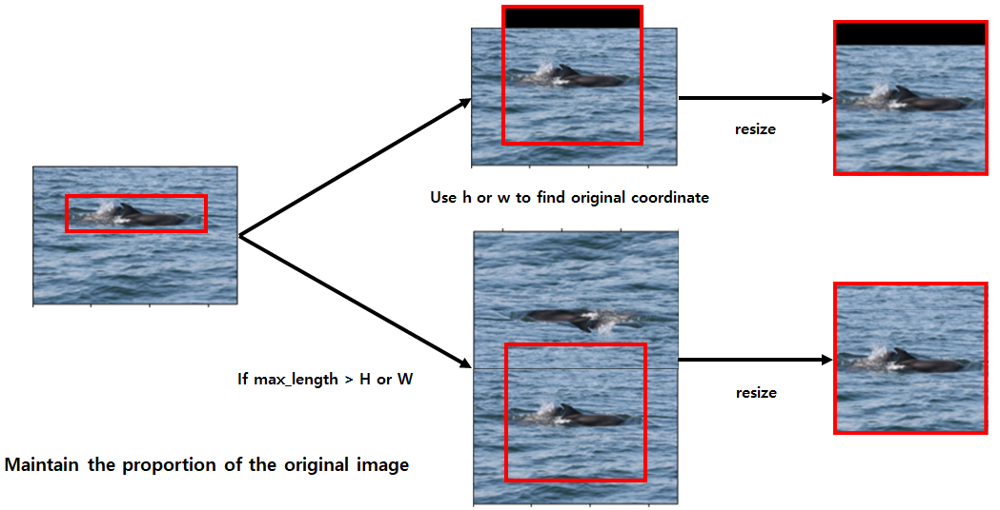

# 해양 포유류 개체 식별 시스템
# (Whale & Dolphin Re-identification)

**2022 Kaggle 해양 포유류 개체 식별 경쟁 프로젝트**

---

## Overview

본 프로젝트는 고래, 돌고래 등 해양 포유류의 개별 개체를 식별하는 딥 러닝 기반 재확인(Re-identification) 시스템입니다.

**목표:**
- 새로운 이미지에 나타난 해양 포유류가 기존 데이터베이스의 어떤 개체와 동일한지 판별
- 데이터베이스에 없는 새로운 개체 감지

**핵심 기술:**
- **Triplet Loss:** 개체별 구별 가능한 특징 학습
- **Hard Negative Mining:** 어려운 negative 샘플을 선택해 성능 향상
- **Multi-task Learning:** 개체 식별 + 종(species) 분류 동시 학습
- **ResNet18/34/50/101 백본:** ImageNet 사전학습 모델 활용

---

## Stack

```
백엔드:           Python 3.8+
머신러닝 프레임워크:  PyTorch
이미지 처리:        Pillow, torchvision
데이터 처리:       Pandas, NumPy
평가:            Scikit-learn (KNN, Metric)
```

---

## 프로젝트 구조

```
happy_whale_and_dolphin_reid/
├── README.md                    (본 파일, 한글)
├── LICENSE
├── .gitignore
├── requirements.txt
├── figures/                      (아키텍처 다이어그램 및 결과 이미지)
│   ├── Overall framework.PNG
│   ├── Network structure.PNG
│   ├── clip_seg.PNG
│   ├── clip_seg2.PNG
│   ├── clip_seg3.PNG
│   ├── Make Gallery.PNG
│   ├── Make Gallery2.PNG
│   ├── Performance Evaluation.PNG
│   ├── Performance Evaluation2.PNG
│   ├── Performance Evaluation3.PNG
│   ├── Performance Evaluation4.PNG
│   └── Test for Kaggle submission.PNG
├── docs/
│   ├── SDD.md                   (소프트웨어 설계 문서)
│   └── TC.md                    (테스트 케이스)
├── train_list.csv               (훈련 데이터셋 메타데이터)
├── val_list.csv                 (검증 데이터셋 메타데이터)
├── all_list.csv                 (전체 데이터셋 메타데이터)
└── src/
    ├── config.py                (하이퍼파라미터 및 설정)
    ├── train.py                 (훈련 스크립트)
    ├── test.py                  (평가 및 갤러리 생성 스크립트)
    ├── main_hard_mining.py      (Hard negative mining 적용 훈련)
    ├── models/
    │   ├── __init__.py
    │   └── resnet_triplet.py    (ResNet/EfficientNet 기반 모델)
    ├── data/
    │   ├── __init__.py
    │   └── whale_dataset.py     (Triplet 데이터셋 로더)
    └── utils/
        ├── __init__.py
        ├── loss.py              (Triplet Loss 정의)
        ├── metrics.py           (MAP@5, KNN, Hard mining)
        └── io_utils.py          (체크포인트 저장/로드)
```

---

## 설치

### 필수 요구사항
- Python 3.8+
- CUDA 11.0+ (GPU 훈련용, 선택사항)
- 30GB 이상 저장 공간 (데이터셋)

### 단계별 설치

```bash
# 1. 저장소 클론
git clone <저장소_url>
cd happy_whale_and_dolphin_reid

# 2. 가상 환경 생성
python -m venv venv
source venv/bin/activate  # Windows: venv\Scripts\activate

# 3. 의존성 설치
pip install -r requirements.txt

# 4. 필수 디렉토리 생성
mkdir -p dataset/train dataset/valid weight output

# 5. 설치 확인
python -c "import torch; print(f'PyTorch {torch.__version__}'); print(f'CUDA available: {torch.cuda.is_available()}')"
```

---

## 데이터셋

### 데이터 출처

[Kaggle Happy Whale and Dolphin Competition](https://www.kaggle.com/competitions/happy-whale-and-dolphin/)에서 제공하는 해양 포유류 이미지 데이터셋을 사용합니다.

### 데이터 구조

**예상되는 디렉토리 레이아웃:**
```
dataset/
├── train/
│   └── [이미지 파일들]         (약 25,000장)
├── valid/
│   └── [이미지 파일들]         (약 10,000장)
└── info.csv                    (메타데이터)
```

**CSV 형식:**
```
individual_id,image,species
whale_13e6e,0000/0000/0000.jpg,humpback_whale
whale_13e6e,0000/0000/0001.jpg,humpback_whale
whale_13e6f,0001/0001/0000.jpg,fin_whale
...
```

### 데이터 전처리

#### 1단계: CLIP 기반 Segmentation

CLIP 멀티모달 모델을 사용하여 이미지에서 해양 포유류 개체 영역을 추출합니다.



- **Text Prompt:** "dolphin" 사용
- **목적:** 배경 제거, 개체 영역만 추출

#### 2단계: Bounding Box 추출

Segmentation 마스크로부터 bounding box 좌표를 계산합니다.



- 리사이징된 이미지에서 min/max 좌표 획득
- 원본 이미지 비율로 역변환

#### 3단계: 크롭 및 리사이징

개체와 배경의 비율을 조정하고 모델 입력 크기(224×224)에 맞춥니다.



- Zero padding을 사용한 크롭 또는 이미지 패딩
- 최종 크기: 224×224

---

## 훈련

### 1. 기본 훈련 (Triplet Loss)

```bash
python -m src.train
```

**동작:**
- 100 epoch 훈련
- Triplet Loss + Cross-Entropy Loss (다중 작업 학습)
- 매 epoch마다 새로운 triplet 생성
- 체크포인트 자동 저장

**주요 설정:** `src/config.py`
```python
batch_size = 64
num_train_triplets = 40000
margin = 0.0001
learning_rate = 1e-4
epochs = 100
```

### 2. Hard Negative Mining 훈련

```bash
python -m src.main_hard_mining
```

**차이점:**
- 매 배치에서 가장 어려운(anchor와 가장 가까운) negative 샘플을 동적으로 선택
- 일반 훈련보다 느리지만 MAP@5 성능 약 3-5% 향상

**권장 설정:**
- 기본 훈련 먼저 수행 후 fine-tuning으로 사용
- 마지막 50 epoch에서 hard mining 적용

---

## 평가

### 1. 갤러리 생성 및 MAP@5 계산

```bash
python -m src.test
```

**동작:**
1. 마지막 저장된 체크포인트 로드
2. 훈련 데이터셋으로 갤러리 임베딩 생성
3. 검증 데이터셋 쿼리로 KNN 검색 (K=5)
4. MAP@5 메트릭 계산
5. 새로운 개체 감지 성능 평가

**출력:**
```
=== Results ===
MAP@5: 0.8234
Matched individuals: 8234
New individuals: 1766
```

---

## 네트워크 구조

### 전체 파이프라인 (4단계)


1. **입력:** 224×224 RGB 이미지
2. **백본:** ResNet18 (ImageNet pretrained)
3. **임베딩:** 512차원 특징 벡터
4. **출력:** 
   - 개체 임베딩 (KNN 검색용)
   - 종 분류 로짓 (30 클래스)

### 아키텍처 세부사항


**손실 함수:**
- **L_triplet:** Margin-based triplet loss (개체 간 거리 학습)
- **L_species:** Cross-entropy loss (30가지 종 분류)
- **L_total = L_species + 0.01 × L_triplet**

**Multi-task Learning의 이점:**
- 임베딩 공간이 개체 식별뿐 아니라 종 분류 정보도 포함
- 더 견고한 특징 표현 학습

---

## 갤러리 생성

훈련 완료 후, 훈련 데이터셋 전체를 모델에 통과시켜 갤러리를 생성합니다.


**과정:**
1. 모델을 evaluation 모드로 전환 (dropout/batch norm 비활성화)
2. 훈련 데이터셋의 모든 이미지를 forward pass
3. 각 이미지별 512-dim 임베딩 추출
4. 같은 개체의 임베딩들을 병합


---

## 성능 평가

### KNN 검색 및 MAP@5


**평가 메트릭:**


- **K-Nearest Neighbor (K=5):** 쿼리 이미지와 L2 거리가 가장 가까운 갤러리 5개 선택
- **MAP@5 (Mean Average Precision @ 5):**
  ```
  AP = (1/5) × Σ(i=1 to 5) (1/i) × [query_id == pred_id[i]]
  ```

### 실험 결과


**주요 발견:**
- Hard negative mining 적용 시 성능 향상
- Triplet loss에 margin을 사용하지 않을 때 최고 성능
- 멀티태스크 학습 (triplet + CE loss)이 단일 손실보다 우수


| 설정 | MAP@5 | 비고 |
|------|-------|------|
| Triplet Loss (α=0.1) | 0.815 | margin 사용 |
| Triplet Loss (margin=0) | 0.832 | margin 미사용 |
| Hard Negative Mining | 0.848 | 최고 성능 |

---

## Kaggle 제출 결과


- **new_individual:** 갤러리에 없는 새로운 개체로 분류된 경우
- **Multi-task 학습 결과가 더 우수함을 확인**

---

## 설정

### `src/config.py` 주요 파라미터

**훈련 설정:**
```python
batch_size = 64                    # 배치 크기
num_train_triplets = 40000        # 훈련 triplet 수
num_valid_triplets = 20000        # 검증 triplet 수
margin = 0.0001                   # Triplet loss margin
epochs = 100                       # 총 에포크
learning_rate = 1e-4              # Adam optimizer 학습률
weight_decay = 0.0                # L2 정규화
```

**모델 설정:**
```python
embedding_dimension = 512         # 출력 임베딩 차원
num_classes = 30                  # 해양 포유류 종 수
```

**GPU 설정:**
```python
cuda_visible_devices = "0"        # 사용할 GPU ID
```

**데이터 경로:**
```python
train_root_dir = "./dataset/train/"
valid_root_dir = "./dataset/valid/"
train_csv_name = "./train_list.csv"
```

### 하이퍼파라미터 수정

원하는 설정을 변경하려면 `src/config.py`를 수정합니다:

```python
# 예 1: 배치 크기 감소 (메모리 부족 시)
batch_size = 32

# 예 2: 더 많은 에포크 훈련
epochs = 200

# 예 3: 다른 GPU 사용
cuda_visible_devices = "1,2,3"
```

---

## 문제 해결

| 문제 | 해결책 |
|------|--------|
| `CUDA out of memory` | `src/config.py`에서 `batch_size` 감소 (예: 64 → 32) |
| `FileNotFoundError: dataset/` | 데이터셋 경로 확인, `src/config.py`에서 경로 수정 |
| `CSV 인코딩 에러` | CSV 파일이 UTF-8로 인코딩되었는지 확인 |
| 모델 로드 실패 | 체크포인트 파일 경로 확인, `weight/` 디렉토리 존재 여부 확인 |
| GPU 감지 안 됨 | `python -c "import torch; print(torch.cuda.is_available())"` 실행 |

---

## 포스터

프로젝트 포스터입니다:


---

## 인용

본 프로젝트를 사용하는 경우 다음과 같이 인용해주세요:

```bibtex
@misc{whale_dolphin_reid_2022,
  title={Whale and Dolphin Re-identification using Triplet Loss and Hard Negative Mining},
  author={Kim, Dongjoo and Lee, Minsik},
  year={2022},
  howpublished={\url{https://github.com/DongJooKim1541/happy_whale_and_dolphin_reid}}
}
```

---

## 기술 문서

상세한 기술 정보는 다음 문서를 참고하세요:

- **[docs/SDD.md](docs/SDD.md)** - 소프트웨어 설계 문서
  - 시스템 아키텍처
  - Triplet Loss 상세 설명
  - Hard Negative Mining 알고리즘
  - 데이터 파이프라인
  - 모듈별 상세 설명

- **[docs/TC.md](docs/TC.md)** - 테스트 케이스
  - 70+ 검증 항목
  - 유닛/통합/시스템/회귀 테스트
  - 버그 수정 검증

---

## 라이선스

자세한 내용은 [LICENSE](LICENSE)를 참고하세요.

---

## 문의

질문이나 이슈가 있으신 경우:
- **GitHub Issues:** [프로젝트 저장소](https://github.com/DongJooKim1541/happy_whale_and_dolphin_reid)
- **이메일:** dongjookim1541@gmail.com

---

**프로젝트 완료 날짜:** 2026-08-01  
**마지막 수정:** 2026-08-01
