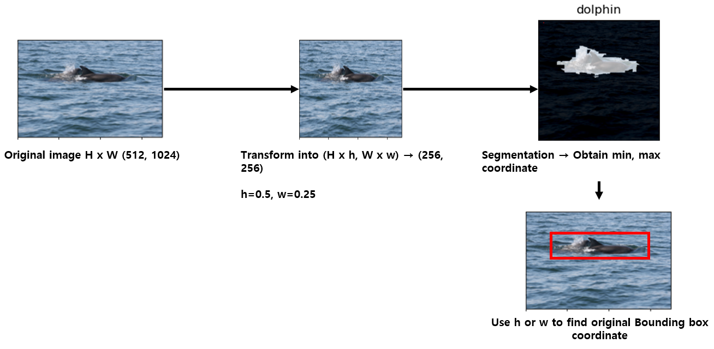

## Marin mammal re-identification project 
2022년에 해양 포유류 재확인 (Marine mammal re-identification) 프로젝트를 수행했습니다.


## 활용 기술
```
Python  
CNN(Convolutional Neural Network)
Segmentation
Pytorch
```

## About task
- 고래 및 돌고래 등의 개체 사진 활용
- 새롭게 찍힌 사진에 나타나는 개체가 기존에 수집했던 자료 중 어떤 개체와 일치하는지 판정

## 1. Dataset
[해양 포유류 데이터](https://www.kaggle.com/competitions/happy-whale-and-dolphin/)를 활용하여 인공지능 모델 학습

## 2. Data preprocessing
- [CLIP](http://proceedings.mlr.press/v139/radford21a/radford21a.pdf)을 이용한 image segmentation([Image Segmentation Using Text and Image Prompts, CVPR 2022](https://openaccess.thecvf.com/content/CVPR2022/papers/Luddecke_Image_Segmentation_Using_Text_and_Image_Prompts_CVPR_2022_paper.pdf)) 기술 사용
- Text prompt로 "dolphin" 사용 <br/>

<br/><br/>


<br/><br/>
<br/><br/>

## 3. Re-identification & performance evaluation

## 4. Conclusion


